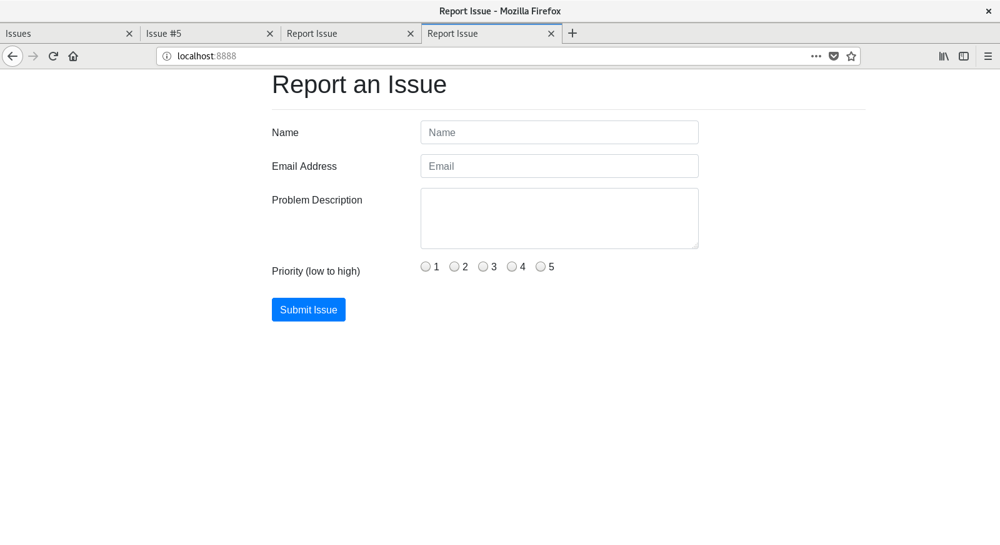
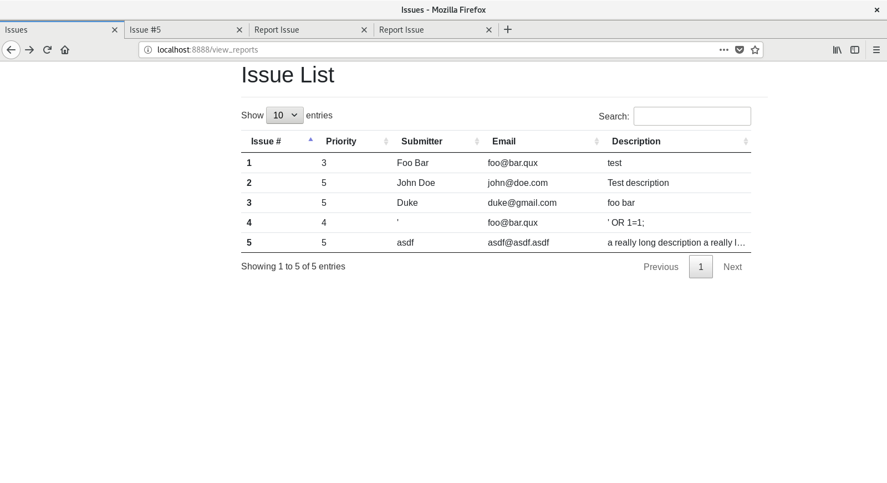
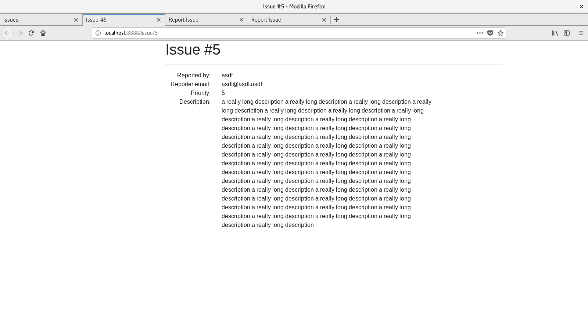

# `bug_report`

A small, simple test webapp using: Tornado Web Framework (Python), Bootstrap 4, jQuery, and MariaDB.

## Screenshots

These screenshots were taken from inside of a Fedora VM using Mozilla Firefox.

Form Fill:

____
Issue List:

The issue list is sortable and searchable quite easily, thanks to DataTables.
____
Issue Page:
